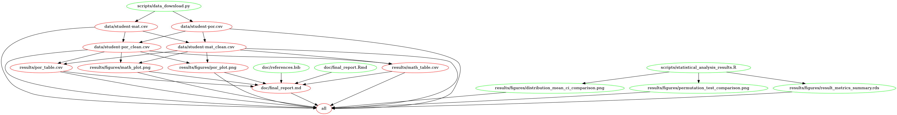

# To Love or Not to Love: Project Proposal

## About

With this project, we attempt to run inferential analysis to determine if there is any significant difference between the total grades of secondary school students who are in a relationship and those who are not.   
The analysis is conducted on the `Student Performance Dataset` from the UCI Machine Learning Repository (https://archive.ics.uci.edu/ml/datasets/student+performance)

This data set details student performance indicators (grades) of secondary school students for two courses in the form of two data sets, one for Maths and one for Portugese, along with 30 features spanning information pertaining to school activities, social behaviour and family background. The data set has been compiled using school reports and questionnaires answered by secondary school students in Portugal.

References:

- Original Owner: Paulo Cortez, University of Minho, Guimarães, Portugal, http://www3.dsi.uminho.pt/pcortez
- P. Cortez and A. Silva. Using Data Mining to Predict Secondary School Student Performance. In A. Brito and J. Teixeira Eds., Proceedings of 5th FUture BUsiness TEChnology Conference (FUBUTEC 2008) pp. 5-12, Porto, Portugal, April, 2008, EUROSIS, ISBN 978-9077381-39-7. [[Web Link](http://www3.dsi.uminho.pt/pcortez/student.pdf)]
- Dua, D. and Graff, C. (2019). UCI Machine Learning Repository [http://archive.ics.uci.edu/ml]. Irvine, CA: University of California, School of Information and Computer Science

## Research Questions

The analysis will focus on answering the following inferential research questions:

- Do secondary school students who are in a relationship have different grades for Maths than students who are not?
- Do secondary school students who are in a relationship have different grades for Portugese than students who are not?

## Report

The final report can be found [here](https://github.com/UBC-MDS/DSCI-522_City_of_A-Stars_310/blob/master/doc/final_report.md)

## Usage

There are two ways in which this analysis can be replicated:

Option 1: **Using Docker**

1. Install [Docker](https://www.docker.com/get-started)
2. Clone this GitHub repository
3. Navigate to the root directory of the project in terminal
4. Run `docker run --rm -v /$(pwd):/usr/src/project manu2856/mds_workflows_g310 make -C /usr/src/project clean` at the terminal
5. Run `docker run --rm -v /$(pwd):/usr/src/project manu2856/mds_workflows_g310 make -C /usr/src/project all` at the terminal

*note: Windows users can run the following commands in Bash in place of steps (4) and (5) above*
*`docker run --rm -v ${PWD}:/usr/src/project manu2856/mds_workflows_g310 bash -c "make -C /usr/src/project clean"`*
*`docker run --rm -v ${PWD}:/usr/src/project manu2856/mds_workflows_g310 bash -c "make -C /usr/src/project all"`*

Option 2: **Without using Docker**

1. Clone this GitHub repository
2. Install the [dependencies](#dependencies) listed below
3. Navigate to the root directory of the project in terminal
3. Run `make all` at the command line/terminal
4. To reset the repo to a clean state, with no intermediate or results files, run the `make clean` at the command line/terminal

## Makefile Dependency Diagram

Following is a map of how each file in project directory is connected:

## Dependencies 

Python 3.7.3 and Python packages:

  - docopt>=0.6.2
  - requests>=2.22.0
  - pytest>=5.0.1
  - pandas>=0.24.2
  - numpy>=1.16.4
  - altair>=4.0.1

R version 3.6.1 and R packages:

  - tidyverse>=1.3.0
  - infer>=0.5.1
  - ggthemes>=4.2.0
  - docopt>=0.6.1
  - gridExtra>=2.3
  - cowplot>=1.0.0
  - tools>=3.6.1
  - testthat>=2.3.1
  - knitr>=1.26
  - kableExtra>=1.1.0
  - rmarkdown>=2.1
