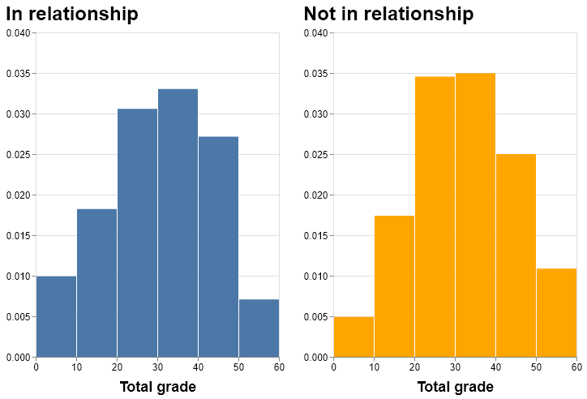
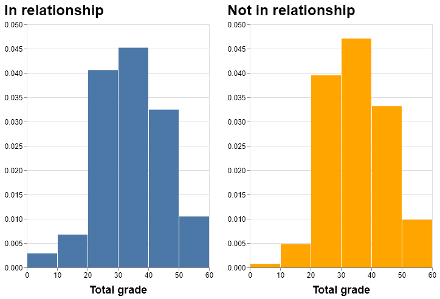
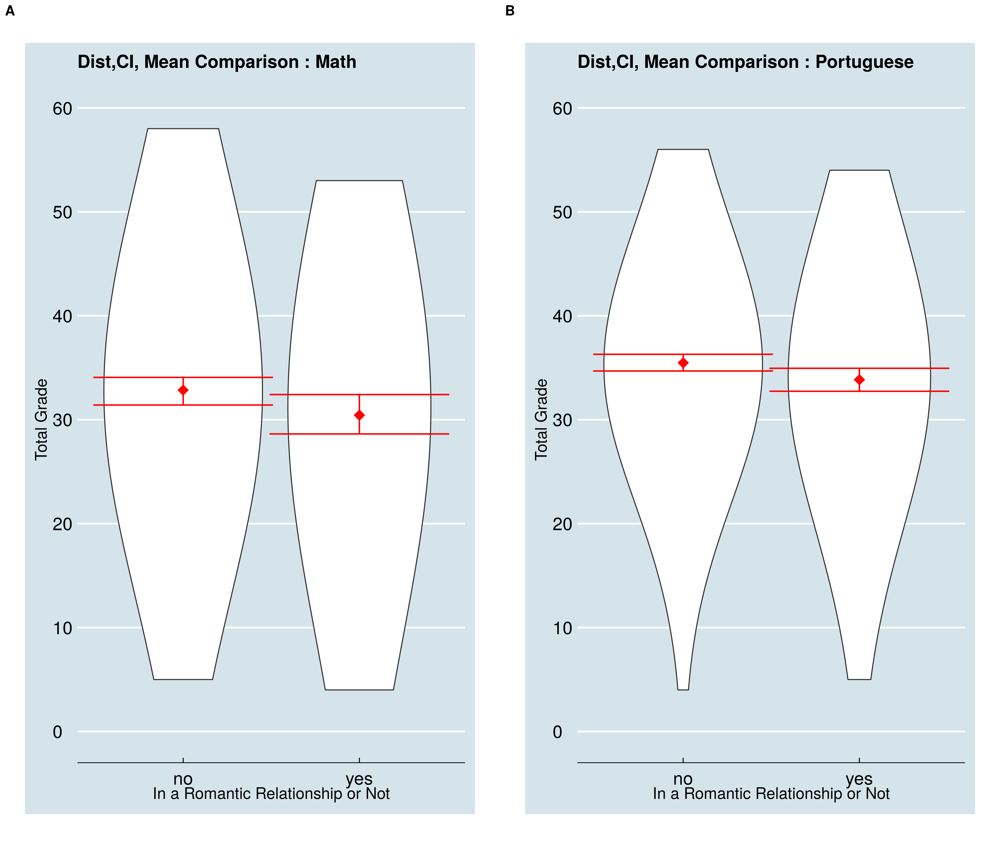
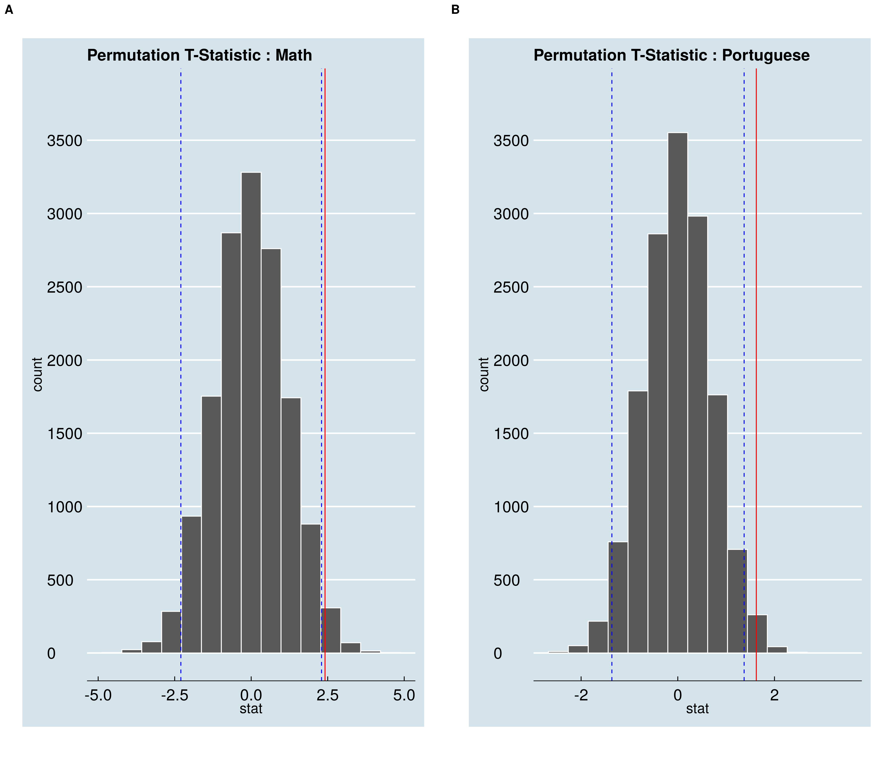

```{r setup, include=FALSE}
knitr::opts_chunk$set(echo = TRUE)
library(knitr)
library(kableExtra)
library(tidyverse)
```

```{r load model results, include=FALSE}
table_math_eda <- read_csv("../results/math_table.csv")
table_por_eda <- read_csv("../results/por_table.csv")
table <- readRDS("../results/figures/result_metrics_summary.rds")
```

# Motive & Research Questions

'Will being in a relationship affect my grade?' This is a question that quite a few students have and a data-driven analysis for it will certainly pique people's interest. The report explores this avenue for secondary school students by setting up hypothesis tests in order to answer the following research questions:

- Do secondary school students who are in a relationship have different grades for Maths than students who are not?
- Do secondary school students who are in a relationship have different grades for Portugese than students who are not?

We attempt to conduct two permutation tests; one for students of Maths course and the other for Portugese, to explore the statistical significance of our hypotheses. 

# Methods

### Exploring the data

The analysis for this project has been conducted on data sets of secondary school students and their performance in Maths and Portugese. This data has been compiled using school reports and questionnaires answered by secondary school students in Portugal by Paulo Cortez, University of Minho, Portugal and has been sourced from UCI Machine Learning Repository [@Dua:2019]. These datasets can be found [here](https://archive.ics.uci.edu/ml/datasets/student+performance).

The data details student performance indicators (grades) of secondary school students for two courses in the form of two data sets, one for Maths and one for Portugese, along with 30 features spanning information pertaining to school activities, social behaviour and family background.

Our first step in exploring the data was looking at the distributions of grades of students for both the subjects to help us track cases of extreme outliers or extreme skewness. Following are the histograms for grades for both the subjects across the students' relationship status. Math grades of students seem to be fairly normally distributed regardless of whether they are in a relationship or not, but for Portugese, the distribution seems to be slightly negatively skewed.  


```{r math_grade_distribution, echo=FALSE, fig.cap="Figure 1. Maths grade distribution for students involved in a relationship and those who are not", out.width='60%', fig.align='center'}

```


```{r port_grade_distribution, echo=FALSE, fig.cap="Figure 2. Portugese grade distribution for students involved in a relationship and those who are not", out.width='60%', fig.align='center'}

```


Further, we looked at descriptive statistics, including mean, standard deviation and counts among the levels of the binary variable for whether a student is involved in a romantic relationship.

```{r math_descriptive_stats, echo=FALSE}
kable(table_math_eda, caption = "Table 1. Descriptive Statistics for gardes of Maths students") %>%
  kable_styling(full_width = F)
```


```{r echo=FALSE}
kable(table_por_eda, caption = "Table 2. Descriptive Statistics for gardes of Portugese students") %>%
  kable_styling(bootstrap_options = "striped", full_width = F)
```
There does not seem to be much difference between the standard deviation of students who are in a relationship and those who are not for both the subjects. But, we did notice a case of class imbalance with the proportion of students involved in a relationship being nearly a third of the total sample of students for both the subjects.

### Analysis

We carried out two Permuation tests (one for subject Maths and one for Portugese). The choice of test was influenced by the fact that Permuation Tests are a good choice for analysis of unbalanced classes [@perm_test]. For the purpose of our analysis, we made use of 4 columns from each data set (Maths and Portugese), a binary variable for whether a student is in a romantic relationship and 3 columns for grades throughout the year (on a scale of 0-20). The grades received throughout the year were added and have been used as 'total grades' (on a scale of 0-60) for the analysis. The null ($H_0$) and alternate hypothesis ($H_1$) set up for both the subjects were as follows

$$H_0: \text{Average total grade of students who are in a relationship is same as for students who are not in a relationship}$$
$$H_1: \text{Average total grade of students who are in a relationship is not the same as for students who are not in a relationship}$$


Both R [@R] and Python [@Python] programming languages were used along with packages including docopt [@docopt], tidyverse [@tidyverse], knitr [@knitr], cowplot [@cowplot], infer [@infer], ggthemes [@ggthemes], gridExtra [@grid_extra], tools [@tools], testthat [@testthat], kableExtra [@kableextra], NumPy [@numpy], pandas [@pandas], altair [@altair]. 


# Results & Discussions

We set our level of significance at 5% and first computed the 95% Confidence Intervals (CIs) for both, Maths and Portugese total grades, for comparison between grades of students in a relationship and those who are not.


```{r ci_over_plot, echo=FALSE, fig.cap="Figure 3. Grade distribution overlayed with confidence intervals for mean total grade based on relationship status", out.width='80%', fig.align='center'}

```

For both Maths and Portugese, we observe that there is a slight overlap between the confidence intervals for both groups (in relationship and not in relationship). This indicates that there may not be a significant difference between the average total grades of students in a relationship and those who are not [@CI].

The test statistic for Maths' students was 2.412 and for Portugese's students was 1.628.

The simulation based null distribution along with the CIs and test statistic for both the subjects were visualized as follows:


```{r null_distributions, echo=FALSE, fig.cap="Figure 4. Null distribution of grades overlayed with confidence intervals for mean total grade based and test statistics", out.width='80%', fig.align='center'}

```


In both the cases, we observed that the test statistic lies beyond the confidence interval range. For Maths' student grades, this value is very close to the upper CI value. Further, p values for both the tests are

```{r echo=FALSE}
kable(table) %>%
  kable_styling()
```

The p-values for both the tests are less than 0.05, our criteria for level of significance, which implies that the we have enough evidence to reject the null hypothesis and that the results are statiscally significant. Thus, we can conclude that, for both Maths and Portugese, there is a statistically significant difference between the average overall grades of students who are in a relationship and those who are not.

The results of our study are currently only based on confidence intervals and p-values. These statistics alone are not enough to predict effect size or plausible difference in magnitude of the effect grades have on students of both the subjects. As our next step, to further improve this analysis and compare the significance of results obtained from both the hypothesis tests, we would look into the effect size for Maths and Portugese students. We would also like to extend the study and explore whether the grades of students are influenced by a combination of factors, such as, being in a relationship and their gender, which could be approached by hypothesis testing techniques such as multi-factor ANOVA.

# References