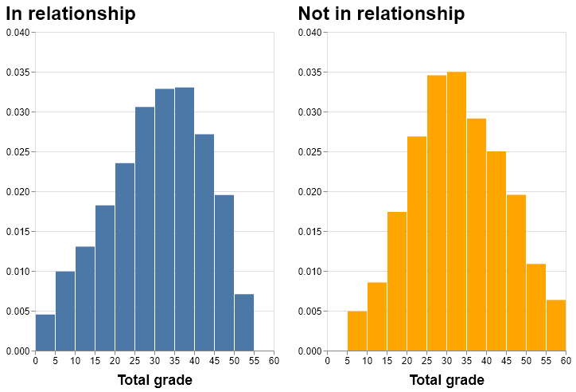
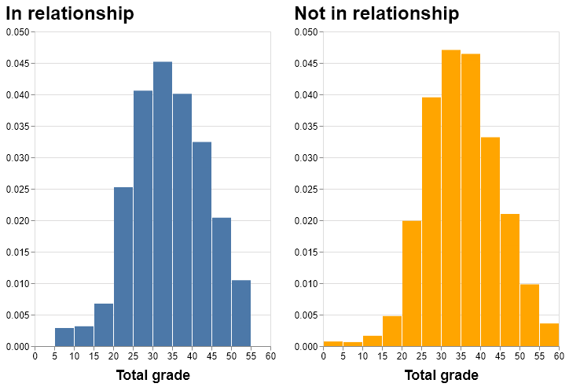
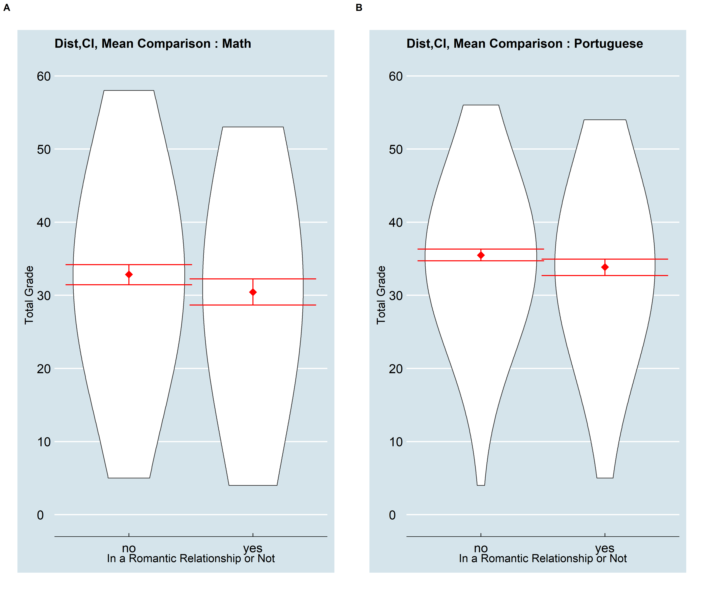
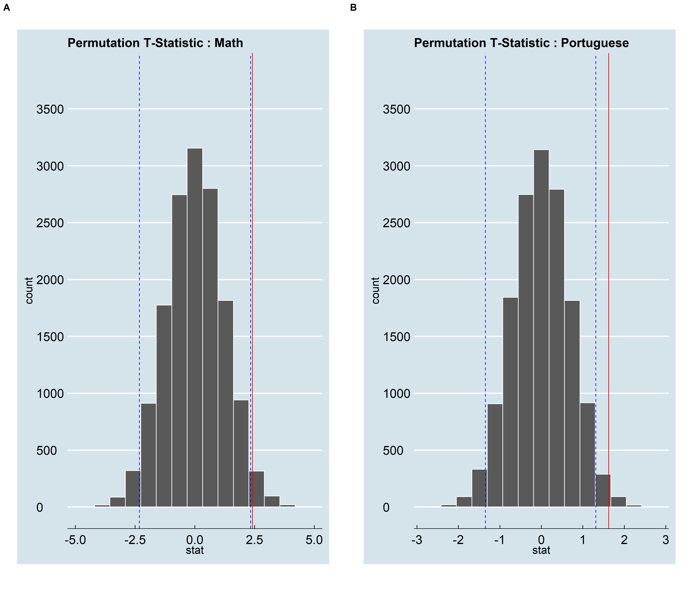

Inferring association between romantic relationships and grades
================

# Motive & Research Questions

‘Will being in a relationship affect my grade?’ This is a question that
quite a few students have and a data-driven analysis for it will
certainly pique people’s interest. The report explores this avenue for
secondary school students by setting up hypothesis tests in order to
answer the following research questions:

  - Do secondary school students who are in a relationship have
    different grades for Maths than students who are not?
  - Do secondary school students who are in a relationship have
    different grades for Portugese than students who are not?

We attempt to conduct two permutation tests; one for students of Maths
course and the other for Portugese, to explore the statistical
significance of our hypotheses.

# Methods

### Exploring the data

The analysis for this project has been conducted on data sets of
secondary school students and their performance in Maths and Portugese.
This data has been compiled using school reports and questionnaires
answered by secondary school students in Portugal by Paulo Cortez,
University of Minho, Portugal and has been sourced from UCI Machine
Learning Repository (Dua and Graff 2017). These datasets can be found
[here](https://archive.ics.uci.edu/ml/datasets/student+performance).

The data details student performance indicators (grades) of secondary
school students for two courses in the form of two data sets, one for
Maths and one for Portugese, along with 30 features spanning information
pertaining to school activities, social behaviour and family background.

Our first step in exploring the data was looking at the distributions of
grades of students for both the subjects to help us track cases of
extreme outliers or extreme skenwness. Following are the histograms for
grades for both the subjects across the students’ relationship status.
Math grades of students seem to be fairly normally distributed
regardless of whether they are in a relationship or not, but for
Portugese, the distribution seems to be slightly negatively
skewed.

Further, we looked at descriptive statistics, including mean, variance
and counts among the levels of the binary variable for whether a student
is involved in a romantic
relationship.

<table class="table" style="width: auto !important; margin-left: auto; margin-right: auto;">

<caption>

Table 1. Descriptive Statistics for gardes of Maths
students

</caption>

<thead>

<tr>

<th style="border-bottom:hidden" colspan="1">

</th>

<th style="border-bottom:hidden; padding-bottom:0; padding-left:3px;padding-right:3px;text-align: center; " colspan="1">

count

</th>

<th style="border-bottom:hidden; padding-bottom:0; padding-left:3px;padding-right:3px;text-align: center; " colspan="1">

mean

</th>

<th style="border-bottom:hidden; padding-bottom:0; padding-left:3px;padding-right:3px;text-align: center; " colspan="1">

variance

</th>

</tr>

<tr>

<th style="text-align:left;">

romantic

</th>

<th style="text-align:right;">

X2

</th>

<th style="text-align:right;">

X3

</th>

<th style="text-align:right;">

X4

</th>

</tr>

</thead>

<tbody>

<tr>

<td style="text-align:left;">

no

</td>

<td style="text-align:right;">

263

</td>

<td style="text-align:right;">

32.84411

</td>

<td style="text-align:right;">

121.5901

</td>

</tr>

<tr>

<td style="text-align:left;">

yes

</td>

<td style="text-align:right;">

132

</td>

<td style="text-align:right;">

30.43182

</td>

<td style="text-align:right;">

122.8426

</td>

</tr>

</tbody>

</table>

<table class="table table-striped" style="width: auto !important; margin-left: auto; margin-right: auto;">

<caption>

Table 2. Descriptive Statistics for gardes of Portugese
students

</caption>

<thead>

<tr>

<th style="border-bottom:hidden" colspan="1">

</th>

<th style="border-bottom:hidden; padding-bottom:0; padding-left:3px;padding-right:3px;text-align: center; " colspan="1">

count

</th>

<th style="border-bottom:hidden; padding-bottom:0; padding-left:3px;padding-right:3px;text-align: center; " colspan="1">

mean

</th>

<th style="border-bottom:hidden; padding-bottom:0; padding-left:3px;padding-right:3px;text-align: center; " colspan="1">

variance

</th>

</tr>

<tr>

<th style="text-align:left;">

romantic

</th>

<th style="text-align:right;">

X2

</th>

<th style="text-align:right;">

X3

</th>

<th style="text-align:right;">

X4

</th>

</tr>

</thead>

<tbody>

<tr>

<td style="text-align:left;">

no

</td>

<td style="text-align:right;">

410

</td>

<td style="text-align:right;">

35.47317

</td>

<td style="text-align:right;">

67.84891

</td>

</tr>

<tr>

<td style="text-align:left;">

yes

</td>

<td style="text-align:right;">

239

</td>

<td style="text-align:right;">

33.84937

</td>

<td style="text-align:right;">

78.44780

</td>

</tr>

</tbody>

</table>

There does not seem to be much difference between the variance of
students who are in a relationship and those who are not for both the
subjects. But, we did notice a case of class imbalance with the
proportion of students involved in a relationship being nearly a third
of the total sample of students for both the subjects.

### Analysis

We carried out two Permuation tests (one for subject Maths and one for
Portugese). The choice of test was influenced by the fact that
Permuation Tests are a good choice for analysis of unbalanced classes
(Wikipedia contributors 2020). For the purpose of our analysis, we made
use of 4 columns from each data set (Maths and Portugese), a binary
variable for whether a student is in a romantic relationship and 3
columns for grades throughout the year (on a scale of 0-20). The grades
received throughout the year were added and have been used as ‘total
grades’ (on a sclae of 0-60) for the analysis. The null (\(H_0\)) and
alternate hypothesis (\(H_1\)) set up for both the subjects were as
follows

\[H_0: \text{Average total grade of students who are in a relationship is same as for students who are not in a relationship}\]
\[H_1: \text{Average total grade of students who are in a relationship is not the same as for students who are not in a relationship}\]

Both R (R Core Team 2019a) and Python (Van Rossum and Drake 2009)
programming languages were used along with packages including docopt (de
Jonge, n.d.), tidyverse (Wickham et al. 2019), knitr (Xie 2019), cowplot
(Wilke 2019), infer (Bray et al. 2019), ggthemes (Arnold 2019),
gridExtra (Auguie 2017), tools (R Core Team 2019b), testthat (Wickham
2011), kableExtra (Zhu 2019), NumPy (Oliphant 2006), pandas (McKinney
2010), altair (VanderPlas et al. 2018).

# Results & Discussions

We set our level of significance at 5% and first computed the 95%
Confidence Intervals (CIs) for both, Maths and Portugese total grades,
for comparison between grades of students in a relationship and those
who are
not.

We notice that there is not much overlap between the CIs for both the
cases. This implies that there are only a few points from the range of
plausible values in which the true value of average total grade of
students lies with a 95% probability, and hence, it may happen that
there may not be significant difference between the average total grades
of students in a relationship and those who are not.

The test statistic for Maths’ students was 2.412 and for Portugese’s
students was 1.628.

The simulation based null distribution along with the CIs and test
statistic for both the subjects were visualized as
follows:

In both the cases, we observed that the test statistic lies beyond the
confidence interval range. For Maths’ student grades, this value is very
close to the upper CI value. Further, p values for both the tests are

<table class="table" style="margin-left: auto; margin-right: auto;">

<thead>

<tr>

<th style="text-align:left;">

Course

</th>

<th style="text-align:right;">

lower

</th>

<th style="text-align:right;">

upper

</th>

<th style="text-align:right;">

mean

</th>

<th style="text-align:left;">

romantic

</th>

<th style="text-align:right;">

t\_statistic

</th>

<th style="text-align:right;">

p\_value

</th>

</tr>

</thead>

<tbody>

<tr>

<td style="text-align:left;">

Math

</td>

<td style="text-align:right;">

31.49392

</td>

<td style="text-align:right;">

34.23260

</td>

<td style="text-align:right;">

32.84411

</td>

<td style="text-align:left;">

no

</td>

<td style="text-align:right;">

2.412288

</td>

<td style="text-align:right;">

0.0444000

</td>

</tr>

<tr>

<td style="text-align:left;">

Math

</td>

<td style="text-align:right;">

28.62102

</td>

<td style="text-align:right;">

32.25019

</td>

<td style="text-align:right;">

30.43182

</td>

<td style="text-align:left;">

yes

</td>

<td style="text-align:right;">

2.412288

</td>

<td style="text-align:right;">

0.0444000

</td>

</tr>

<tr>

<td style="text-align:left;">

Portuguese

</td>

<td style="text-align:right;">

34.67524

</td>

<td style="text-align:right;">

36.32213

</td>

<td style="text-align:right;">

35.47317

</td>

<td style="text-align:left;">

no

</td>

<td style="text-align:right;">

1.623798

</td>

<td style="text-align:right;">

0.0185333

</td>

</tr>

<tr>

<td style="text-align:left;">

Portuguese

</td>

<td style="text-align:right;">

32.75251

</td>

<td style="text-align:right;">

35.02929

</td>

<td style="text-align:right;">

33.84937

</td>

<td style="text-align:left;">

yes

</td>

<td style="text-align:right;">

1.623798

</td>

<td style="text-align:right;">

0.0185333

</td>

</tr>

</tbody>

</table>

The p-values for both the tests are less than 0.05, our criteria for
level of significance, which implies that the we have enough evidence to
reject the null hypothesis and that the results are statiscally
significant. Thus, we can conclude that, for both Maths and Portugese,
there is a statistically significant difference between the average
overall grades of students who are in a relationship and those who are
not.

The results of our study are currently only based on confidence
intervals and p-values. These statistics alone are not enough to predict
effect size or plausible difference in magnitude of the effect grades
have on students of both the subjects. As our next step, to further
improve this analysis and compare the significance of results obtained
from both the hypothesis tests, we would look into the effect size for
Maths and Portugese students. We would also like to extend the study and
explore whether the grades of students are influenced by a combination
of factors, such as, being in a relationship and their gender, which
could be approached by hypothesis testing techniques such as
multi-factor ANOVA.

# References

Arnold, Jeffrey B. 2019. *Ggthemes: Extra Themes, Scales and Geoms for
’Ggplot2’*. <https://CRAN.R-project.org/package=ggthemes>.

Auguie, Baptiste. 2017. *GridExtra: Miscellaneous Functions for "Grid"
Graphics*. <https://CRAN.R-project.org/package=gridExtra>.

Bray, Andrew, Chester Ismay, Evgeni Chasnovski, Ben Baumer, and Mine
Cetinkaya-Rundel. 2019. *Infer: Tidy Statistical Inference*.
<https://CRAN.R-project.org/package=infer>.

de Jonge, Edwin. n.d. *Docopt: Command-Line Interface Specification
Language*. <https://CRAN.R-project.org/package=docopt>.

Dua, Dheeru, and Casey Graff. 2017. “UCI Machine Learning Repository.”
University of California, Irvine, School of Information; Computer
Sciences. <http://archive.ics.uci.edu/ml>.

McKinney, Wes. 2010. “Data Structures for Statistical Computing in
Python.” In *Proceedings of the 9th Python in Science Conference*,
edited by Stéfan van der Walt and Jarrod Millman, 51–56.

Oliphant, Travis. 2006. *A Guide to Numpy*. USA: Trelgol Publishing.
<http://www.numpy.org/>.

R Core Team. 2019a. *R: A Language and Environment for Statistical
Computing*. Vienna, Austria: R Foundation for Statistical Computing.
<https://www.R-project.org/>.

———. 2019b. *R: A Language and Environment for Statistical Computing*.
Vienna, Austria: R Foundation for Statistical Computing.
<https://www.R-project.org/>.

VanderPlas, Jacob, Brian Granger, Jeffrey Heer, Dominik Moritz, Kanit
Wongsuphasawat, Eitan Lees, Ilia Timofeev, Ben Welsh, and Scott Sievert.
2018. “Altair: Interactive Statistical Visualizations for Python.”
*Journal of Open Source Software*, December. The Open Journal.
<https://doi.org/10.21105/joss.01057>.

Van Rossum, Guido, and Fred L. Drake. 2009. *Python 3 Reference Manual*.
Scotts Valley, CA: CreateSpace.

Wickham, Hadley. 2011. “Testthat: Get Started with Testing.” *The R
Journal* 3: 5–10.
<https://journal.r-project.org/archive/2011-1/RJournal_2011-1_Wickham.pdf>.

Wickham, Hadley, Mara Averick, Jennifer Bryan, Winston Chang, Lucy
D’Agostino McGowan, Romain François, Garrett Grolemund, et al. 2019.
“Welcome to the tidyverse.” *Journal of Open Source Software* 4 (43):
1686. <https://doi.org/10.21105/joss.01686>.

Wikipedia contributors. 2020. “Resampling (Statistics) — Wikipedia, the
Free Encyclopedia.”
<https://en.wikipedia.org/w/index.php?title=Resampling_(statistics)&oldid=937864823>.

Wilke, Claus O. 2019. *Cowplot: Streamlined Plot Theme and Plot
Annotations for ’Ggplot2’*.
<https://CRAN.R-project.org/package=cowplot>.

Xie, Yihui. 2019. *Knitr: A General-Purpose Package for Dynamic Report
Generation in R*.

Zhu, Hao. 2019. *KableExtra: Construct Complex Table with ’Kable’ and
Pipe Syntax*. <https://CRAN.R-project.org/package=kableExtra>.

